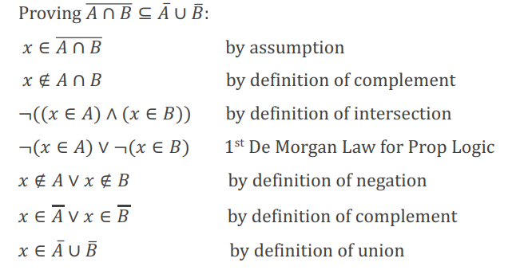

# cs204

2024 가을학기 이산구조 정라하려고 만든거  
영어를 못해서 한국어로 보고 싶어서 만들어봄  
빠트린 내용, 추가할 설명 등은 풀 리퀘로  

## Chepter 1, 2  
ch1은 그냥 기초  
논리 연산 관련 내용인데  
드모르간 증명같은 것도 나올 수 있을지도  

그리고 ⊕ 이 기호 xor로 나와있던데 많이 안 쓰는 거라 알아두면 좋을듯 

---
Quantifiers에 대해 배우는데 당연히 교환법칙 성립 안함  
여러 개 있을 경우 어떻게 된다 설명이 있긴 한데 이건 그냥 생각 좀 하면 된다  

---
Normal Forms에 대해 배우는데  
PDNF, PCNF에 대해서만 알아두면 된다  

Minterm -> TF 논리 테이블에서 1개만 True로 만드는 and로 연결된 조건  
Maxterm -> TF 논리 테이블에서 1개만 False로 만드는 or로 연결된 조건  
Minterm에 or연산 한 것으로 모든 연산을 나타내는 것이 가능하고  
Maxterm에 and연산 한 것으로 모든 연산을 나타내는 것이 가능하다.  
Minterm을 Disjunctive 해서 만든게 PDNF  
Maxterm을 Conjunctive 해서 만든게 PCNF  

---
기수는 일대일대응이 존재함을 보이거나  
한쪽으로 포함되는 것도 있고 다른쪽으로 포함되는 것도 있다.  
이걸 증명하면 된다.  
연속체 가설로 2^2^2...^N (N은 자연수 집합 크기) 이중에 무조건 같은 집합이 존재하게 될거임  
실수 uncountable, countable union is countable 등은 쉬워서 건너뜀  
풀 리퀘를 주시면 넣도록 할게요  

---
$|P(A)| > |A|$에 대한 증명  

어떤 $f : A → P(A)$ injective 함수가 존재한다고 가정하자  
그러면 어떤 집합 $X$를  
$X=\{ a|a \notin f(a) \}$이렇게 잡으면  
$f(x)=X$인 $x$가 존재하지 않음을 보이면 된다.  
만약 $x \in X \Rightarrow X \notin x$ since def of x  
만약 $x \notin X \Rightarrow X \in x$ since def of x  
contradiction 따라서 $f$는 존재하지 않음  

---
String is countable  
So Program is countable  
But function is uncountable  
$\Rightarrow$ There are not computable functions

---
행렬 내용은 별거 없고  
bool 행렬곱은 ⨀ 이 기호를 사용한다.  

## Chepter 3
정렬, 검색은 너무 쉽다.

---
정지 문제에 대해 간단히 생각해보면  
어떤 프로그램 P(p, i)가 존재하여 어떤 프로그램이 정지하면 True, 아니면 false를 반환한다고 하자  
그러면 어떤 프로그램 D를 정의하여  
D(p)=if P(p, p) then loop, else stop(halt)  
이 상태에서 D(D)를 넣어주면  
D가 멈출 경우 P는 True로 무한루프가 돌아서 모순
D가 무한루프일 경우 P는 False로 정지하여 모순
따라서 P같은건 존재하지 않는다.  

---
Big-O, Big-$\Omega$, Big-$\Theta$가 나온다.  
Big-O는 미적1에서도 나왔지만 충분히 큰 n에 대해 상수를 곱한 것보다 작으면 된다.  
Big-$\Omega$의 경우 최적의 경우 어떻게 증가하는지 나타낸다.  
충분히 큰 n에 대해 상수를 곱한 것보다 크면 된다. 
insertion sort의 경우 Big-$\Omega$로는 $\Omega(n)$이고  
보고정렬의 경우 $\Omega(1)$이 된다.  
Big-$\Theta$는 2개가 같을 경우 사용한다. 

---
간단하게 행렬곱에서 곱셈 순서도 언급되는데  
결합법칙은 성립하지만 여기에서 곱셈 계산 횟수는 달라진다.  

P, NP 문제에 대해서도 다루는데  
P는 다항 시간 안에 해결 가능한 문제이고 NP는 아닌 문제이다.  
NP-완전 문제 중 하나라도 P문제이면 P=NP가 되지만 아닐 것 같다. 

## Chapter 4
여기부터 시작이다.  
오늘?은 지쳐서 내일 하겠다. 

